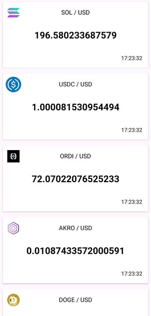
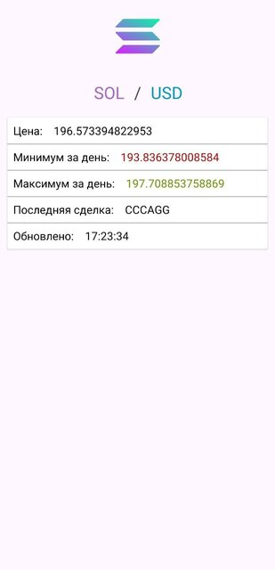

# Crypto App

Android-приложение, отображающее список криптовалют.
Приложение создано с использованием
Retrofit, Hilt, Coroutines, MVVM, и Clean Architecture.
---

## Функции

+ Предоставление актуального списка криптовалют в удобном формате.

---

## Архитектура

Приложение создано с соблюдением чистой архитектуры,
код разделен на три отдельных уровня:
представление, домен и данные.

+ **Уровень представления**:
  уровень отвечает за пользовательский интерфейс
  и взаимодействие с пользователем.
  Он использует шаблон MVVM (Model-View-ViewModel) для отделения логики
  пользовательского интерфейса от бизнес-логики.

+ **Уровень домена**: уровень содержит бизнес-логику приложения.
Он определяет варианты использования и взаимодействие с уровнем данных.

+ **Уровень данных**: уровень отвечает за выборку и хранение данных.
  В нем происходят все сетевые запросы.

При вынесении перечисленных уровней в отдельные модули,
предоставление и внедрение зависимостей осуществляется
в модуле приложения.

---

## Используемые технологии
+ **Kotlin** — официально поддерживаемый Google язык
  разработки приложений для Android.

+ **Android Studio** — официальная интегрированная среда 
  разработки (IDE) для разработки приложений Android.

+ **Retrofit (v 2.10.0)** — HTTP-клиент для Android, 
  используемый для выполнения сетевых запросов.

+ **Hilt** — библиотека от Google, 
используемая для предоставления и внедрения зависимостей.

+ **Coroutines** — компоненты программы, 
  которые позволяют выполнить асинхронные вычисления.

+ **MVVM** — архитектурный шаблон, 
  используемый для отделения логики пользовательского интерфейса от
  бизнес-логики.

---

## Экраны
1. **Список криптовалют**: на экране отображается список криптовалют с их значком, 
  названием, ценой и временем последнего обновления.
  При нажатии на криптовалюту открывается подробный вид.

   
  

2. **Экран детальной информации**: на этом экране отображается 
  более подробная информация о криптовалюте,
  включая минимальную и максимальную цену,
  а также информацию о последней сделке.

   
   

 
---

## Установка
Для установки приложения загрузите **[APK-файл](app-debug-androidTest.apk)**
и откройте его на своем устройстве Android.
Альтернативно вы можете
клонировать репозиторий и создать приложение с помощью Android Studio.
